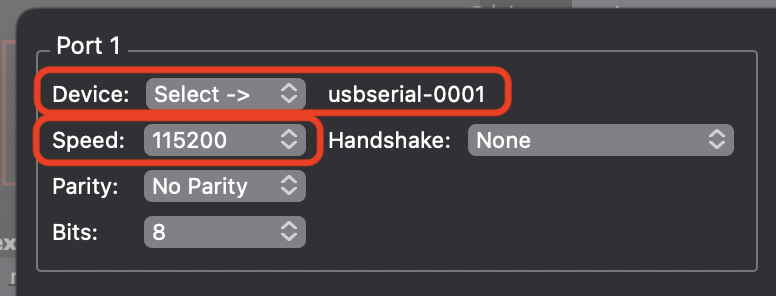
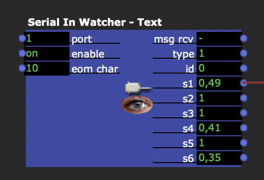
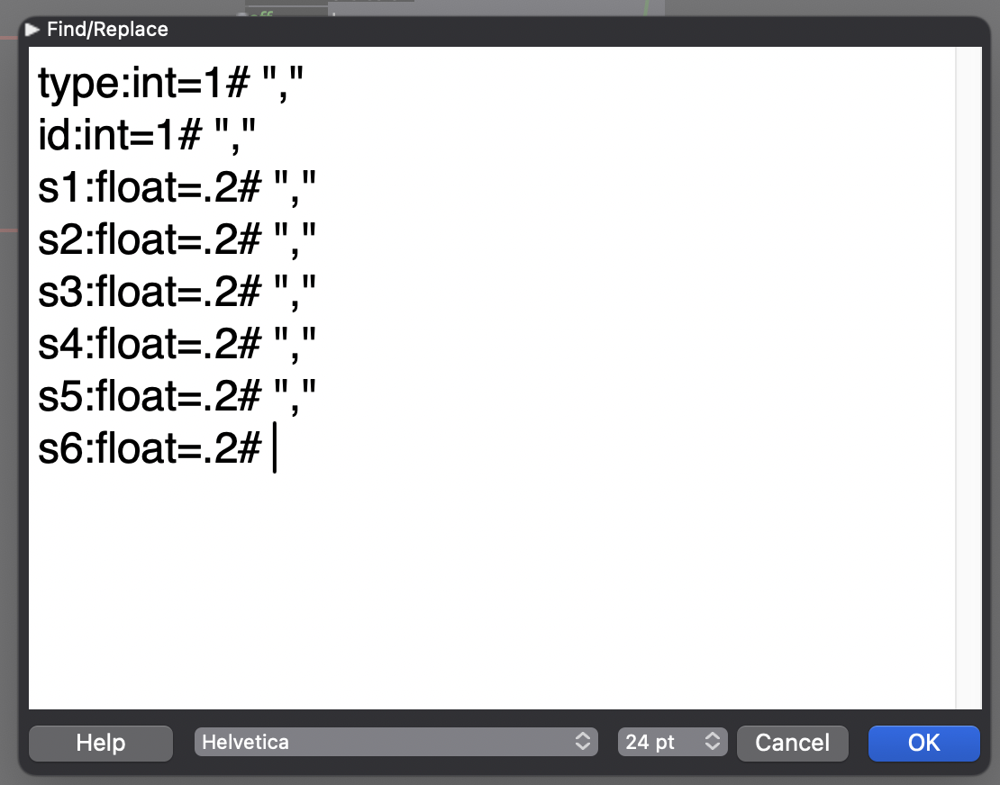
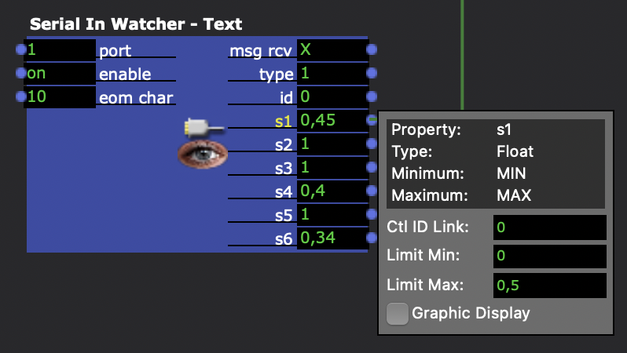

# Spaghettimonster to Isadora

[>>> Click here for the Youtube-Tutorial <<<](https://www.youtube.com/watch?v=YcxWFom0oAI)

## Tutorial

1. "Communications" -> "Serial Port Setup..."

	

2. "Communications" -> "Enable Serial Ports"

3. Create the actor "Serial In Watcher - Text"

	- Set **eom char** to 10 (that's the end-of-message character)
	- double-click the Actor and enter the pattern below into the text field

	

	

	```
	type:int=1# ","
id:int=1# ","
s1:float=.2# ","
s2:float=.2# ","
s3:float=.2# ","
s4:float=.2# ","
s5:float=.2# ","
s6:float=.2# 
	```
	
4. Click on a sensor, e.g. **s1** to specify the output-range of the sensor

	