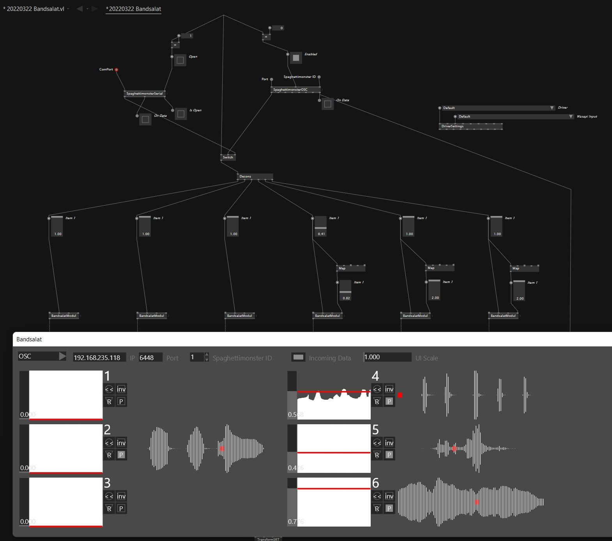

# Spaghettimonster
Firmware for [Kobakant's Spaghetti Monster](https://www.kobakant.at/DIY/?p=9137).

Here you find **two versions** for the Spaghetti Monster:

### Bluetooth MIDI
* Connect to a Computer, Tablet, Smartphone as MIDI Device.
* Input 1-3 are send as **MIDI Notes**
* Input 4-6 are send as **MIDI CC**
* (all values are send with 25fps)

### OSC
* sends all Inputs via OSC. Train it with [Wekinator](http://www.wekinator.org) to have even more fun!
* (all values are send with 25fps)
* so you could also control DMX stage lights like in this example: https://github.com/clockdiv/VLDMX

